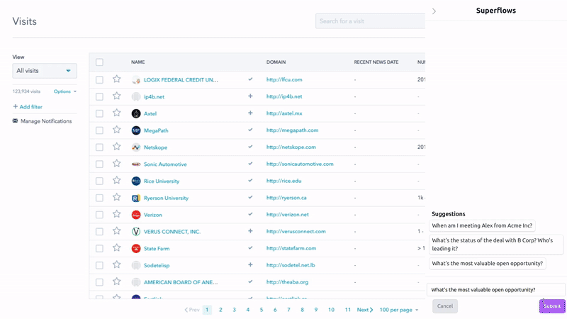

# Introduction

This guide covers how to set up Superflows.

Superflows makes it easy to add an AI assistant that lets users control your product through chat. It can take actions based on user questions, like ChatGPT plugins but within your product.

Superflows is designed to be easy to set up, configure and integrate into your code. In the dashboard, you can control the behaviour of your product assistant, change which actions it can take, and test in a chat playground.

