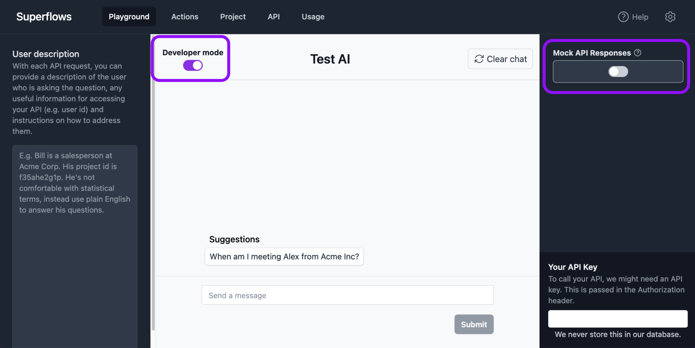

# Playground testing

The [Playground](https://dashboard.superflows.ai/) is where you can test your assistant. It has a chat interface where you can ask questions or give commands and the assistant will reply.

You can ask questions in series, and the assistant will have the context of the previous questions. For example, for a product analytics tool, you may want to start by asking the assistant to retrieve a particular dataset or customer group from your API, which you can then ask questions about.

The key controls in the playground are 'Developer mode', 'Mock API response' and 'API Key'.

### Mock API Responses

Superflows provides an option to mock your API responses. This enables you to play with your assistant without connecting to your API.

Mock API Responses can be enabled or disabled with the toggle on the right hand side of the screen in the sidepanel underneath the language setting.

When enabled, this means the assistant will generate artifical data to respond to the request made in the Playground. The artificial data will be generated based on the type and description provided for the endpoint being mock queried in the API Specification.

Mock API Responses only applies to the Playground. It will not impact any requests made to our API.

### Developer mode

When debugging or testing the assistant, it can be useful to see the thought process of the assistant and requests made by the assistant.

To view these within the playground, Developer mode should be enabled. When enabled you will be able to see the reasoning, plan, and requests sent to your API, as well as the output to the user.

You can find the Developer mode toggle at the top left hand corner of the central chat interface.

### API Key

If you are connecting to your API, you'll need to provide an API Key within the playground to see the outputs there. If you're using Mock API responses, this API key is not required or used.

The API key provided is never stored in our databases.

If you're struggling to connect your API, more information about how this is handled within Superflows can be found in the [Connecting your API documentation page](../category/connecting-your-api).

### More information

Full details about the playground and all to controls available on this page can be found on the [Playground documentation page](../category/playground).
