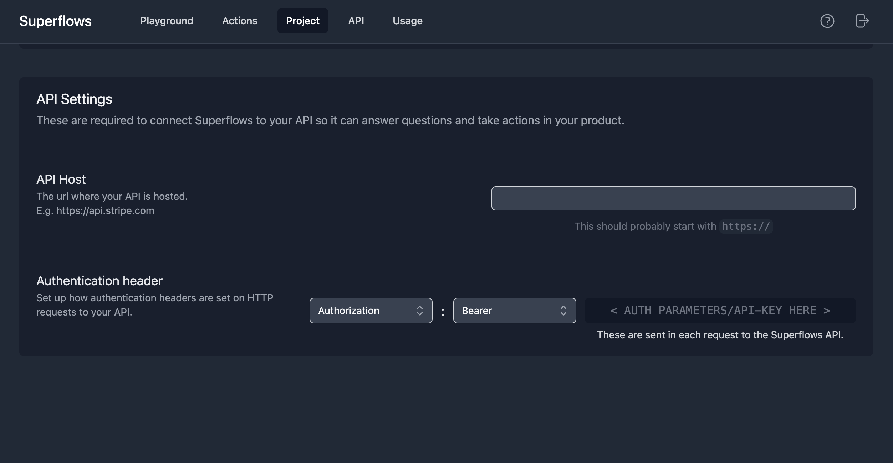

# Connecting to your API

Since Superflows calls your API to respond to user questions, it needs to be able to access your API.

## API Host

Superflows needs to know your API hostname. This is set in the '[Project](https://dashboard.superflows.ai/project)' tab of the Dashboard in the 'API Settings' section:

`Dashboard / Project / API Settings / API Host`

The API host is the url where your API is hosted. It should start with `https://`.

## Authentication header

To authenticate to your API, Superflows needs to correctly add your API key to the header of your API requests.

Superflows needs 2 things:

1. Which header to set: this is set in the dashboard
2. Your API key: this is sent in each request and never stored by Superflows\*

Authentication configuration can be found in the Project page of the Dashboard under `API Settings / Authentication header`. There are two dropdown menus which show the accepted Authentication schemes.

The left-hand menu defines the header used. The right-hand menu defines the authentication scheme used. This is optional and can be set to `None` if necessary.

\*Note: You may not be happy sending your API key to Superflows. If this is the case, you can self-host, so your API key never leaves a server hosted by you. Read the [self-hosting guide](/docs/self-hosting) to understand how to self-host.
