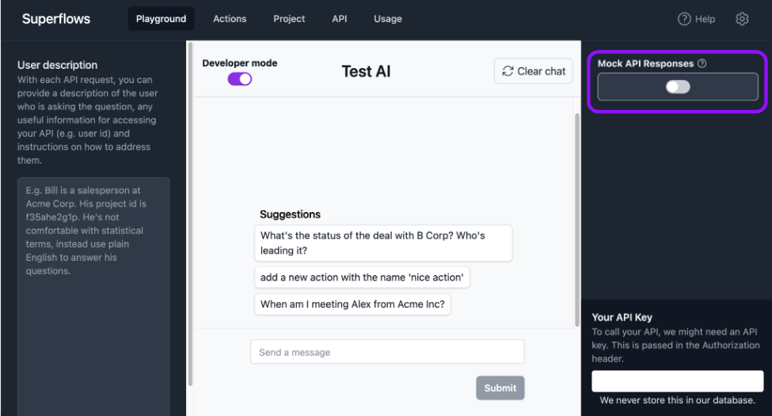

# Mock API Responses

Mocking API Responses enables you to evaluate your assistant without connecting to your API.

It uses GPT to generate fake responses from your API, so you can see the type of API calls your assistant would make to a specific user question.

This can be enabled or disabled with the toggle on the right hand side of the screen in the sidepanel.

When enabled, this means the assistant will generate artifical data to respond to the request made in the Playground. The artificial data will be generated based on the type and description provided for the endpoint being mock queried in the API Specification.

As with all settings in the Playground, setting this toggle only applies to the Playground. It will not impact any requests made to the Superflows API - these are controlled by body parameters sent in the API requests.
