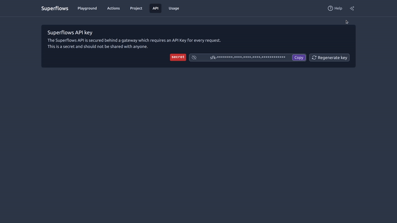

# Superflows Sidebar



The `SuperflowsSidebar` React component only includes the Superflows sidebar.

It can be imported with:

```jsx
import { SuperflowsSidebar } from "@superflows/chat-ui-react";
```

---

## Properties

---

**open** `boolean` _Required_

Whether the sidebar is open or closed. This is a boolean, and can be set to `true` or `false`.

---

**setOpen** `string` _Required_

A function which sets the state of the sidebar. This is required to be passed in, as it allows the sidebar to be closed when the user clicks outside of it.

---

**superflowsApiKey** `string` _Required_

The API key for your Superflows account. It starts `sfk-`. You can find this in the [**Superflows dashboard**](https://dashboard.superflows.ai/api-settings).

---

**superflowsUrl** `string`

The URL of the Superflows deployment. This defaults to the cloud deployment, but if you're self-hosting, or connecting to a local deployment, you'll need to change this.

---

**AIname** `string`

The name of the AI shown in the sidebar window. It doesn't affect the behaviour of the AI.

---

**userApiKey** `string`

The API key for the user to access your API.

Superflows calls your API to answer questions for your user. As a result, this is required if your API requires an API key to access it. This is never stored on our servers or in our databases.

---

**userDescription** `string`

With each API request, you can provide a description of the user who is asking the question, any useful information for accessing your API (e.g. user id) and instructions on how to address them.

---

**suggestions** `string[]`

An array of suggestions to show in the sidebar. These are shown as buttons, and when clicked, the user input is set to the text of the button.

---

**devMode** `boolean`

This enables [**developer mode**](./docs/playground/developer-mode). This is useful for debugging, but should always be set to `false` in production.

---

**mockApiResponses** `boolean`

This toggles mocking API responses, like you can in the [playground](/docs/playground/mock-api-responses).

When set to `true`, all responses from your API are mocked. This can be useful for testing purposes. Set to `false` when in production.

---

**styling** `{
  slideoverSide?: "right" | "left";
  buttonColor?: string;
  headerBackgroundColor?: string;
  headerTextColor?: string;
}`

This allows you to set basic aspects of the style of the Superflows sidebar. This will be expanded to allow much deeper customization in the future.

`slideoverSide` sets which side of the screen the sidebar opens on. Set "right" if you want it to open on the right hand side of the screen.

`buttonColor` sets the colour of the submit button.

`headerBackgroundColor` sets the colour of the header of the sidebar.

`headerTextColor` sets the colour of the text on the header of the sidebar.

---

**initialMessage** `string`

An initial message to "pre-prompt" the AI. When set, on page load this message is programmatically sent to the AI as though the user entered the text into the chat window. Both the initial message and the response from the AI will be visible to the user in the chat window.

(note: this message is sent regardless of whether the sidebar is open)

---

**welcomeText** `string`

Welcome text to be displayed to the user from the assistant. When set it will appear as though the chat assistant has written this message. For example, "Hi, welcome to Acme AI, how may I help you today?"

---
