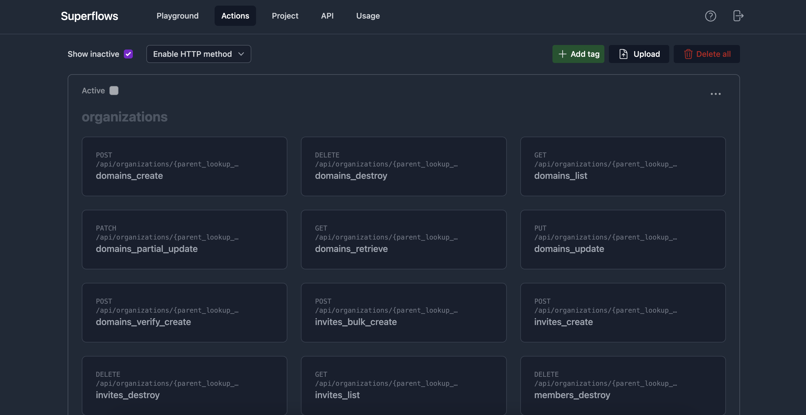
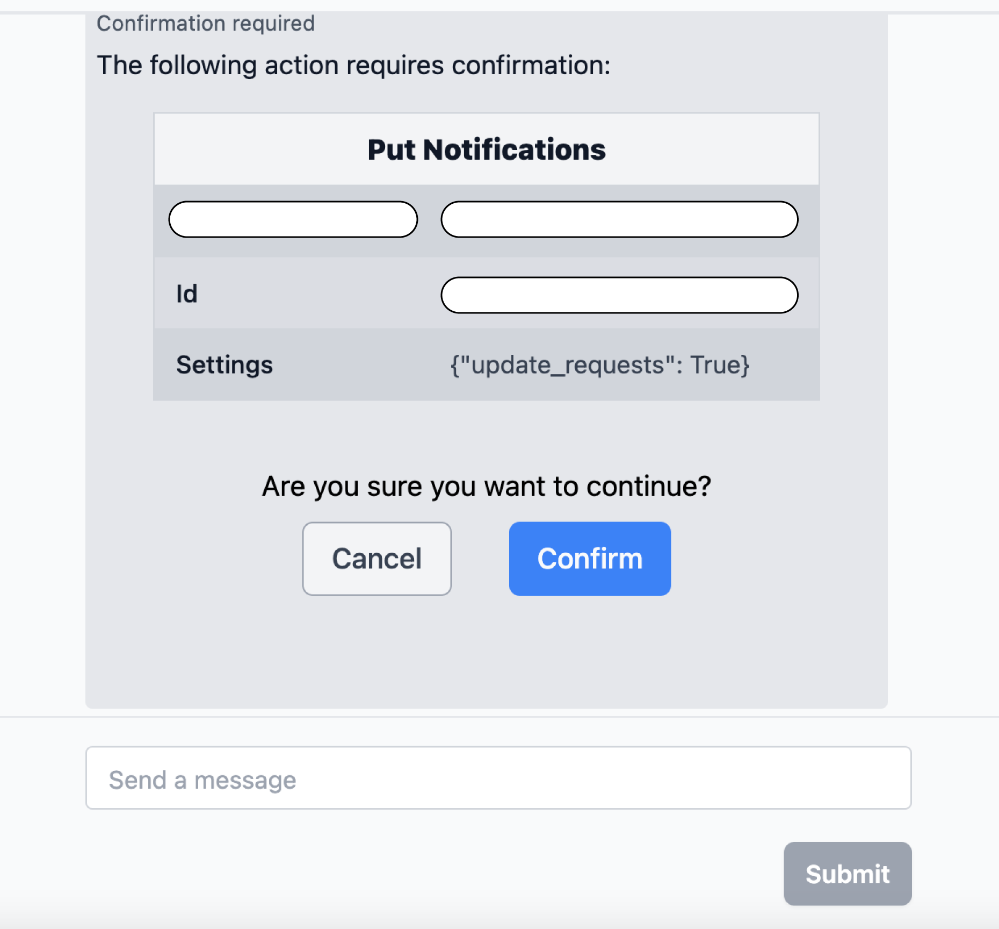

# Build an assistant

## 1. Requirements

- **API specification**. 
    - Superflows accepts an **Open API Specification**, a widely used open standard for API Specificiations. The file can be in json, yml or txt format. Full details can be found on our [API Spec requirements page](../connecting-your-api/api-spec-requirements)
    - If you are unsure whether you have an API specification or what format it is in, you should contact your developer team or our support team
- **Open API**. 
    - In order to make requests to your API it must be open, unless you self-host
    - You will need to provide the **url where your API is hosted**, and an **API key** to give access to the API

## 2. API Specification upload

You can upload your OpenAPI Specification on the 'Actions' tab of the Superflows Dashboard (https://dashboard.superflows.ai/actions) by clicking either 'upload an OpenAPI Specification' or the 'Upload' button'.

When you've uploaded your API, the endpoints will appear as Actions on the dashboard. 

They will be organised into 'tags' depending on how your API Specification is organised. It should look something like this: 

If you hit an error when uploading your API Specification, head to our [API Specification Requirements page](/docs/connecting-your-api/api-spec-requirements).

## 3. Selecting actions

After uploading your API spec you should be able to see actions in the Actions tab. 

By default, all of the `GET` HTTP requests in your API will be selected. You can change this by clicking each individual endpoint (or 'Action' in Superflows terminology) to toggle them on or off, or in bulk by 'tag' or HTTP method.

### Number of actions enabled

Superflows works best when fewer than 20 Actions are enabled. We recommend getting started by enabling a set of actions smaller than 20 that you are most interested in testing.

## Non-GET request confirmation

For non-`GET` requests, Superflows will ask for confirmation. This is because non-`GET` requests will make changes in the account Superflows is connected to. 

Superflows will present the details of the request to you so you can make sure it's safe.

### Bulk action selection

You can also change these in bulk by either the 'tab' the Actions belong to, or by the type of the HTTP request. When getting started, you may want to bulk deselect all actions and then select only those you are most interested in testing. 

More details about this functionality can be found on the [configuration page of the documentation](../category/configuration/)

With your API Spec uploaded and actions selected, continue to testing in the playground.
