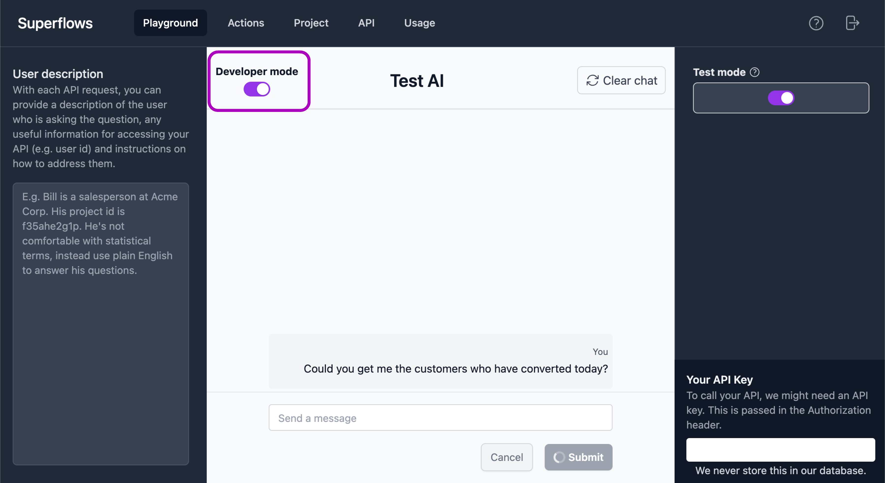

# Developer mode

Developer modes enables you to see the thought process and API calls the assistant performed to arrive at it's answer. This is useful when checking whether the assistant is functioning properly and debugginig performance issues.

In developer mode, a typical output will show:
- Reasoning
    - Enable the AI to process the request and understand what the user wants
- Plan
    - Plan a series of actions that will be required to action this request
- Commands
    - Shows the API calls the assistant will make to get the information required
- Tell user
    - The output of the plan and command steps processed into a chat output to send to the user

### Activating Developer mode

The Developer mode can be toggled on and off in the top left hand corner of the main chat interface in the Playground. 

